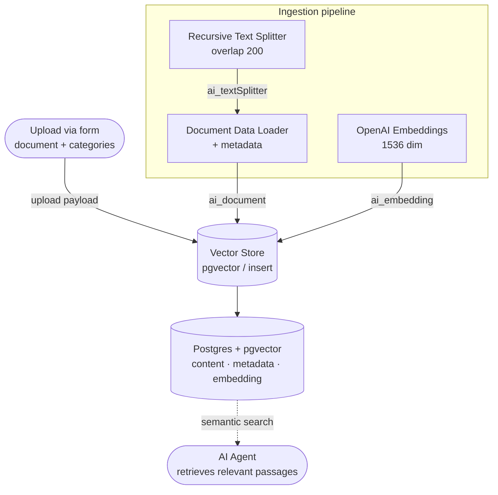

# RAG Knowledge Base

**An ingestion pipeline that turns unstructured documents (PDF, DOCX, TXT, CSV) into a meaning searchable base, so an AI agent answers with the organization's factual content instead of hallucinating.**

---

## The Problem

Organizations pile up knowledge in unstructured documents (PDF, DOCX, TXT, CSV) that an AI agent cannot query directly. You need a simple way to:

- ingest those documents without touching the workflow for every new file;
- make them searchable by semantic similarity (meaning, not just keywords);
- make sure the agent answers from the organization's own factual content instead of hallucinating.

The goal: a self-service entry point that indexes any document and makes it immediately retrievable by the agent.

## The Solution

A form-triggered ingestion workflow receives a document upload and a set of categories (multi-select). The content is split into overlapping chunks, turned into vector embeddings, and written to a vector database (pgvector) alongside metadata for source, categories, and ingestion date. Once indexed, the content is available for semantic search by an agent, which retrieves the most relevant passages regardless of category.

| Capability | How |
|---|---|
| **Self-service ingestion** | Form trigger with upload, so any user feeds the base without editing the flow |
| **Multi-category** | Checkbox (multi-select), so one file can cover several topics |
| **Chunking with overlap** | Recursive splitter with 200 overlap, preserving context at the boundaries |
| **Vector embeddings** | OpenAI (1536 dimensions), turning meaning into a vector |
| **Traceable metadata** | Categories, source, and ingestion date in a `jsonb` column |
| **Similarity search** | pgvector plus `match_documents` (cosine distance), with optional category filter |

## Architecture

## How It Works

| Step | Node | What happens |
|---|---|---|
| **1. Upload** | Form Trigger | The form receives the file (PDF/DOCX/TXT/CSV) plus categories (multi-select checkbox) |
| **2. Split** | Recursive Text Splitter | Breaks the content into chunks with 200 character overlap |
| **3. Load** | Document Data Loader | Loads the chunks and attaches metadata (`categories`, `source`, `ingested_at`) |
| **4. Embed** | OpenAI Embeddings | Generates 1536 dimension vectors for each chunk |
| **5. Index** | Vector Store (pgvector) | Inserts `content + metadata + embedding` into the `documents` table |
| **6. Search** | (consumed by the agent) | The `match_documents` function retrieves passages by cosine distance, with an optional `jsonb` filter |

> The indexer's three inputs (split text, loaded document, embeddings) converge on the Vector Store node through the `ai_textSplitter`, `ai_document`, and `ai_embedding` connections.

## Engineering Decisions

- **Chunking with overlap (recursive text splitter, 200 overlap).** Long documents are broken into smaller pieces with overlap between chunks to preserve context at the cut boundaries. This improves semantic retrieval accuracy, avoiding sentences or ideas being cut in half and losing meaning at search time.
- **Vector database with metadata filtering (pgvector plus `match_documents`).** Content is indexed in pgvector with metadata (categories, source, ingestion date) in a `jsonb` column and cosine distance search. This allows both purely semantic search and optional category filtering, so the agent can find the right passage without relying on perfect manual categorization.
- **Self-service form ingestion with multi-category (checkbox).** The form trigger decouples feeding the base from whoever operates n8n: any user uploads without touching the workflow. Categories as a multi-select checkbox let a single file cover several topics, matching the reality of heterogeneous documents and enriching the metadata for later filtering.
- **Dimension coupling between embedding model and schema (1536).** The `vector` column is sized to match the chosen embedding model exactly. Fixing this correspondence in setup avoids insertion errors and keeps indexing and later agent queries consistent.

## Result / Impact

- Centralizes scattered knowledge into a base that is searchable by meaning, not just keywords
- Enables AI agent answers grounded in your own content (RAG), reducing hallucination
- Lets non-technical users feed the base through a form, without editing the workflow
- Source, category, and ingestion-date metadata make the content traceable and filterable
- Supports multiple document formats (PDF, DOCX, TXT, CSV) through a single entry point

_Generalized metrics. Gabriel: drop in real numbers if you have them._

## Stack & Integrations

`n8n` · `n8n LangChain nodes (data loader · text splitter · embeddings · vector store)` · `OpenAI (embeddings)` · `Supabase / Postgres + pgvector` · `Form trigger / webhook`

## How to Reproduce

1. Import `workflow.json` into your n8n (generic, sanitized version with no credentials)
2. Provision Supabase/Postgres with pgvector and run the setup SQL (`documents` table plus `match_documents` function), see [`docs/setup.md`](docs/setup.md)
3. Set up the credentials in the placeholders: OpenAI (embeddings) and Supabase (vector store)
4. Make sure the embedding model (1536 dim) matches the `vector` column dimension
5. Activate the workflow and open the form URL to run the first upload

## Demo

_~8s GIF showing a document upload and indexing, to be added at `assets/demo.gif`_

---

Built by <a href="https://github.com/GabrielFragaa">Gabriel Fraga</a>, Software & AI Engineer, <a href="https://www.linkedin.com/in/gabrielfragatech/">LinkedIn</a>, <a href="mailto:gabrielfragatech@outlook.com">Email</a>

